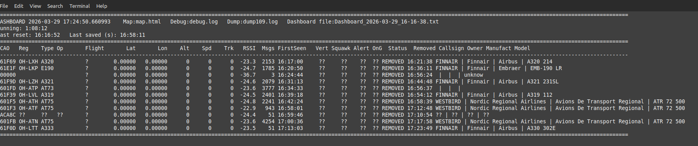
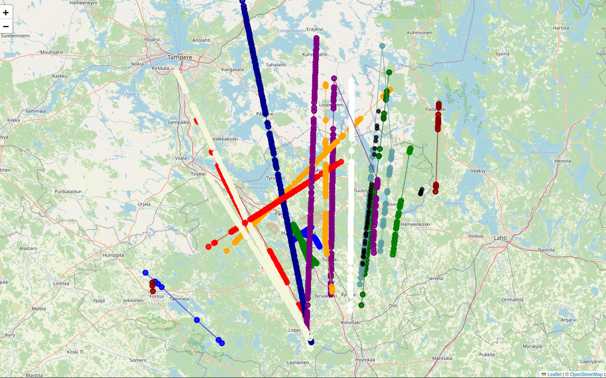

# flight_transponder
Linux terminal dashboard for real-time ADS-B/S (transponder) aircraft tracking

Map to store plane movements (for coordinates sending planes), tooltip provides plane information

Extends presented plane data using public data file

## Used tools

1) Linux SW reader tool: dump1090-mutability, produces JSON file
of detected messages

2) SDR USB dongle: RTL-SDR V4 (with PiHut60cm 1090MHz Antenna for ADS-B/S). Range 100km(ish) indoords. TBD outdoor range  


Install (linux version) of needed SDR/transponder readertool: ```sudo apt-get install dump1090-mutability```

SW includes watchdog if dump1090 gets stuck to generate data to information json file (backgroud reset, not affecting dashboard)

## SW 

**test.py:** Simulates incoming transponder info (into a JSON file)
(new planes added, data updated, old planes removed)

**track_flight_data.py:**  The Dashboard UI. Shows info of bypassing plane transponder data and expanded data using public excel data (zip attached)

**aircraftDatabse.sw:**  Public information file for enhanced plane transponder data 

## USAGE

JSON_FILE definition (in the code) defines real or simulated usage.

Start: ```python3 track_flight_data.py```

Press s to store dashboard snapshot to a file

Simple map with plane path printed:   *map.html*

Debug file:   *debug_file*

Saved dashboard snapshots:   *Dashboard_xxxx.txt*

## Aircraft singnal types shown
# Mode S (Basic)

Provides identification only.

- ICAO address (hex)
- Squawk (if available)
- Callsign (rare)
- RSSI / signal strength
- Message count
- Last seen time

No position data (not shown on map)


# ADS-B (Extended Squitter)

Full real-time tracking data.

- ICAO address
- Callsign (flight)
- Latitude / Longitude
- Altitude
- Ground speed
- Track / heading
- Vertical rate
- Squawk

Shown on map and dashboard


# Enhanced information from public data

- Registration (tail number)
- Aircraft type code
- Airline / operator
- Manufacturer name
- Operator callsign
- Aircraft owner




