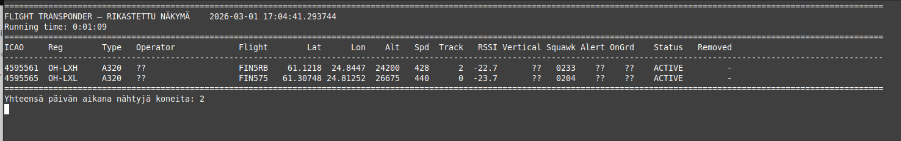

# flight_transponder
Info detector Dashboard of airplanes transponders data

## Used tools

1) Linux SW reader tool: dump1090-mutability

2) SDR USB dongle: RTL-SDR V4 (with 1.5m dipole and long wire attached, indoors). Range 50km(ish)   


Install (linux version) of needed transponder readertool: ```sudo apt-get install dump1090-mutability```

SW includes watchdog (5 min) in case dump1090 gets stuck to generate data information json
(backgroud reset, not affecting Dashboard SW)

## SW 

**test.py:** Simulates incoming transponder info (into a JSON file)
* new planes added, data updated, old planes removed

**test_flight_data.py:**  The Dashboard UI. Shows info of bypassing plane transponder data and expanded data using public excel data (zip attached)

**aircraftDatabse.sw:**  Public information to enhanced transponder data for the plane

## USAGE

JSON_FILE definition (in the code) defines real or simulated usage.

```python3 track_flight_data.py```

Simple map with plan path and message information:   *map.html*

Debug file:   *debug_file*

